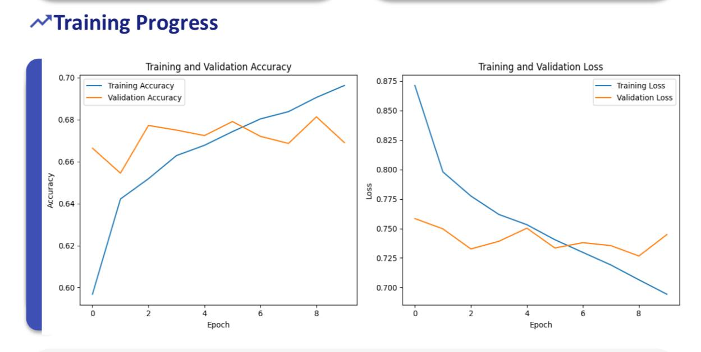
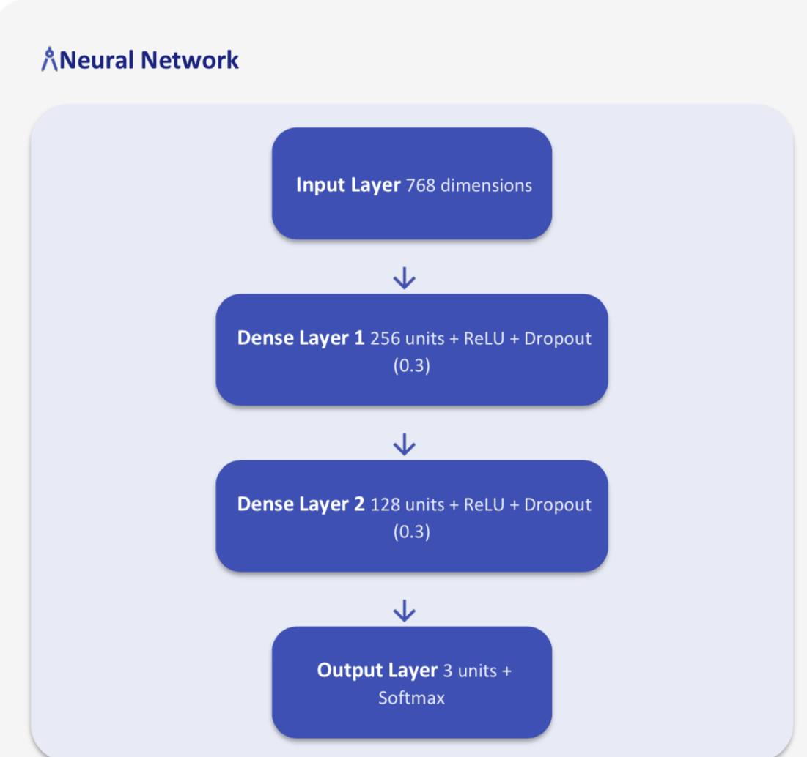

# Twitter Tweets Sentiment Analysis using NLP and Transformers

##  Project Overview
This project implements a complete **Natural Language Processing (NLP)** pipeline for sentiment analysis on Twitter data. The objective is to automatically classify tweets into three sentiment categories: **negative**, **neutral**, and **positive**. The dataset used is the *Twitter Tweets Sentiment Dataset* from Kaggle, which contains approximately **27,000 labeled tweets**. Due to the short and informal nature of tweets, sentiment analysis presents challenges such as slang, abbreviations, sarcasm, and noisy text.

##  Dataset
- **Source:** Kaggle – Twitter Tweets Sentiment Dataset  
- **Size:** ~27,000 tweets  
- **Labels:** Negative, Neutral, Positive  
- **Data Characteristics:** Short text, informal language, social media noise  

## Exploratory Data Analysis
The project begins with exploratory data analysis to understand:
- Sentiment class distribution  
- Tweet length characteristics  
- Overall dataset structure  

This step helps identify class imbalance and guides preprocessing decisions.

## Data Preprocessing
Comprehensive text preprocessing is applied to improve data quality:
- Lowercasing text  
- Removing URLs, mentions, hashtags, and punctuation  
- Stopword removal  
- Lemmatization  
- Removing duplicate and empty tweets  

The cleaned dataset is split into **training, validation, and test sets** using **stratified sampling** to preserve the original sentiment distribution.

##  Text Representation
To convert text into numerical form, the project leverages **DistilBERT**, a transformer-based language model that produces contextual embeddings. Each tweet is represented as a **768-dimensional vector** using mean pooling over token-level embeddings. These embeddings capture semantic meaning and sentiment context more effectively than traditional methods such as Bag-of-Words or TF-IDF.

##  Model Architecture
A neural network classifier is built using **TensorFlow/Keras** on top of the DistilBERT embeddings:
- Two fully connected hidden layers with **ReLU** activation  
- **Dropout regularization** to reduce overfitting  
- A **softmax output layer** for multi-class classification  

The model is trained using the **Adam optimizer** and **categorical cross-entropy loss**.

##  Results and Evaluation
- **Training Accuracy:** ~70%  
- **Validation Accuracy:** ~68%  
- Evaluation metrics include **accuracy, precision, recall, F1-score**, and **confusion matrix analysis**  
- Neutral sentiment is the most challenging class due to ambiguity and overlap with positive and negative expressions  

##  Hugging Face Integration
The project also demonstrates integration with a pretrained Hugging Face transformer model (**DistilBERT fine-tuned on SST-2**) to highlight the limitations of binary sentiment models when applied to multi-class Twitter datasets.

##  Conclusion
This project demonstrates practical experience with modern NLP techniques, transformer-based embeddings, neural network modeling, and systematic evaluation. It provides a complete, end-to-end sentiment analysis workflow suitable for **academic coursework** and **machine learning portfolios**. 

# Visualizations

This section showcases key visualizations that help understand the data and the neural network model:

---

### 1. Training Progress
  
This figure shows the **training progress** of the model, including training **accuracy and loss** across epochs, to track the model’s improvement.

---

### 2. Neural Network Architecture
  
This diagram displays the **architecture of the neural network**, including layers and the number of units in each layer, providing an overview of the model design.

---

### 3. Class & Platform Confusion Matrix
  
The confusion matrix shows the model’s performance in classifying **classes and platforms**, highlighting common misclassifications between categories.

---

### 4. Class & Tweet Length Distribution

This plot illustrates the distribution of classes and tweet lengths in the dataset, helping to understand data balance and text length variations.

---

